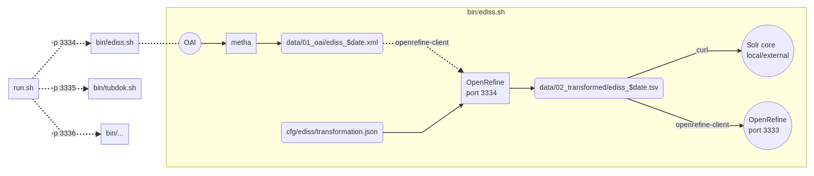

# HOS-MetadataTransformations

[](https://www.codacy.com/app/felixlohmeier/HOS-MetadataTransformations?utm_source=github.com&amp;utm_medium=referral&amp;utm_content=subhh/HOS-MetadataTransformations&amp;utm_campaign=Badge_Grade)

Automated workflow for harvesting, transforming and indexing of bibliographic metadata using [metha](https://github.com/miku/metha), [OpenRefine](http://openrefine.org/) and [Solr](http://lucene.apache.org/solr/). Part of the Hamburg Open Science "Schaufenster" software stack.

## Flowchart



Source: [flowchart.mmd](flowchart.mmd) (try [mermaid live editor](https://mermaidjs.github.io/mermaid-live-editor/))

## Installation

tested with [Ubuntu 16.04 LTS](https://www.ubuntu.com/download/desktop)

download git repository:

```
wget https://github.com/subhh/HOS-MetadataTransformations/archive/master.zip
unzip master.zip
cd HOS-MetadataTransformations-master
```

install JRE, curl, metha, OpenRefine, [openrefine-client](https://github.com/opencultureconsulting/openrefine-client) and Solr:

```
sudo ./install.sh
```

Configure [Solr schema](cfg/solr):

```
./init-solr-schema.sh
```

## Usage

Data will be available after first run at:

* Solr admin: <http://localhost:8983/solr/#/hos>
* Solr browse: <http://localhost:8983/solr/hos/browse>
* OpenRefine: <http://localhost:3333>

Run workflow with data source "ediss" and load data into local Solr and local OpenRefine service

```
bin/ediss.sh
```

Run workflow with all data sources in parallel and load data into local Solr and local OpenRefine service:

```
./run.sh
```

Run workflow with all data sources and load data into external Solr

```
./run.sh -s http://hosdev.sub.uni-hamburg.de:8983/solr/HOS_MASTER

```
